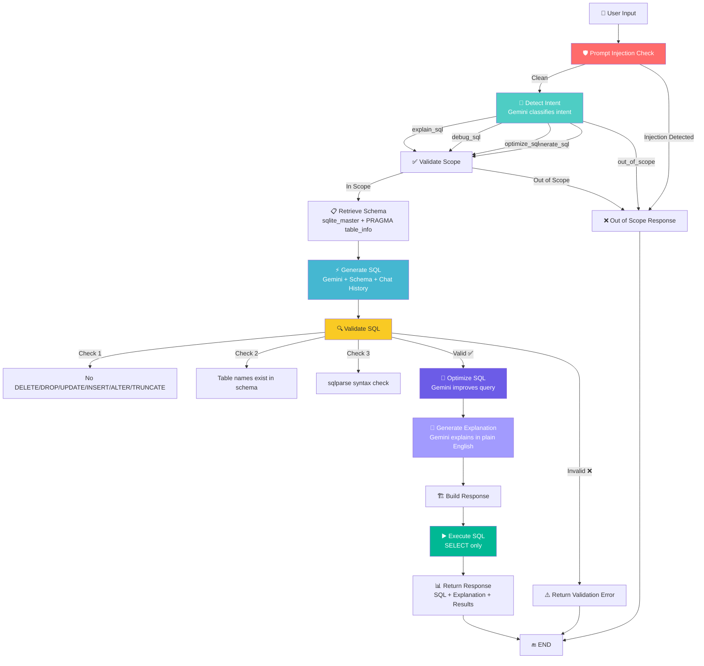
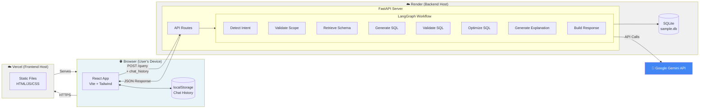
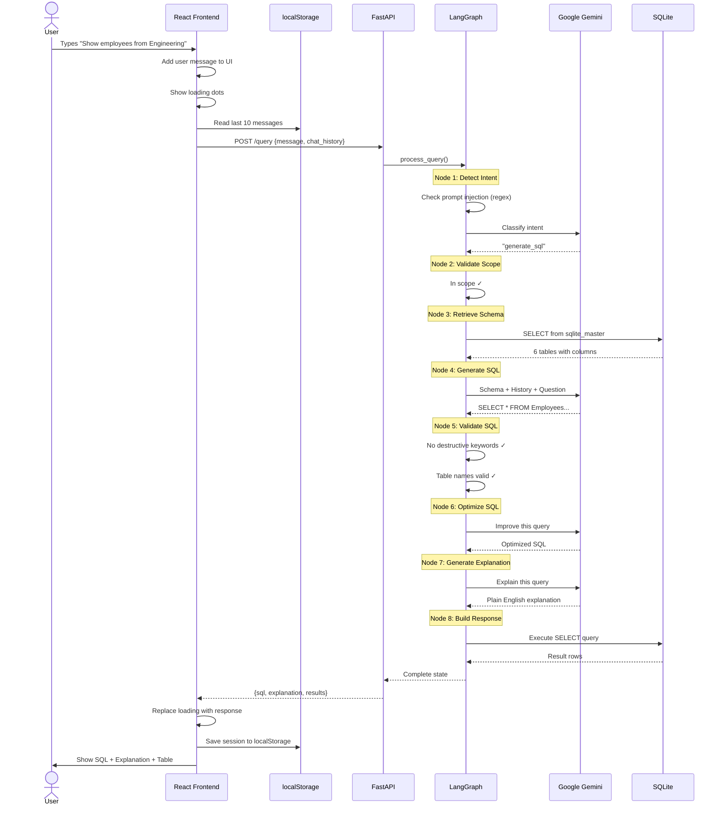
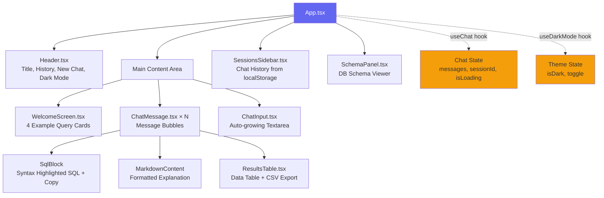
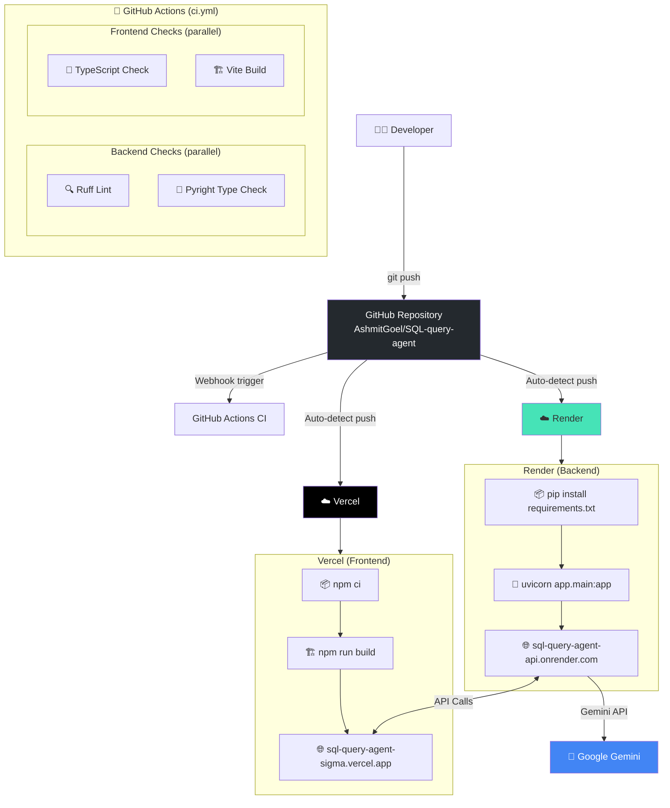
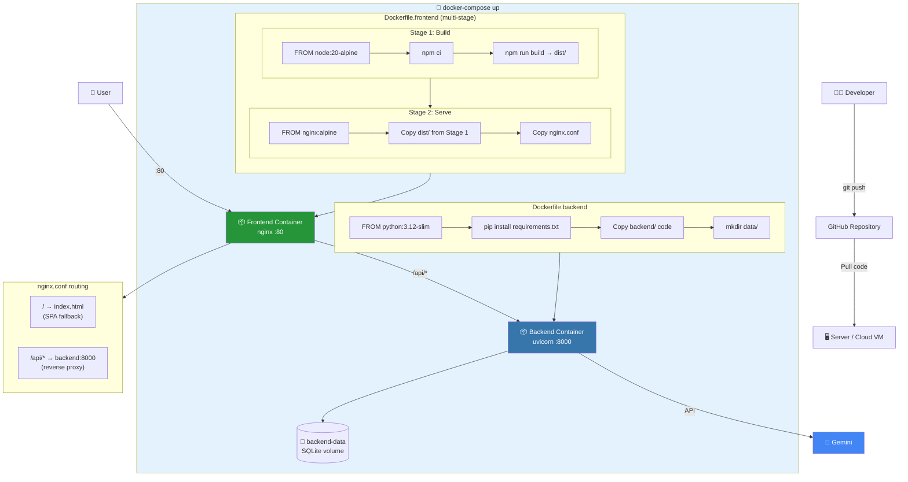
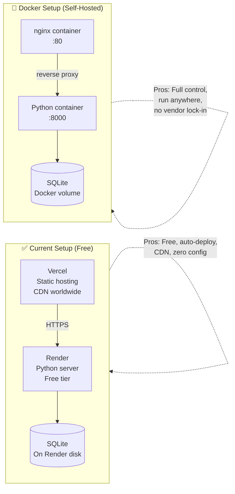

## 1. LangGraph Agent Workflow

## 2. Full System Architecture

## 3. Data Flow — Single Request

## 4. Frontend Component Tree

## 5. CI/CD — Current Deployment (Render + Vercel)

## 6. CI/CD — Docker Deployment (Self-Hosted / Cloud VM)

## 7. Comparison: Current vs Docker Deployment

